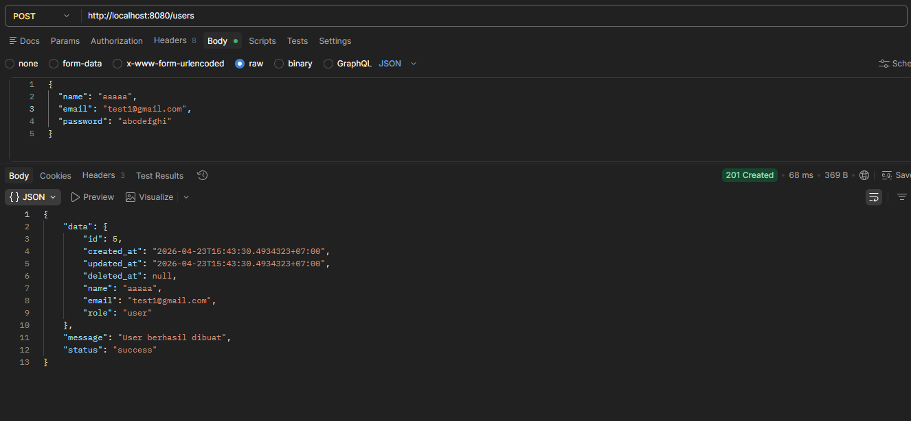
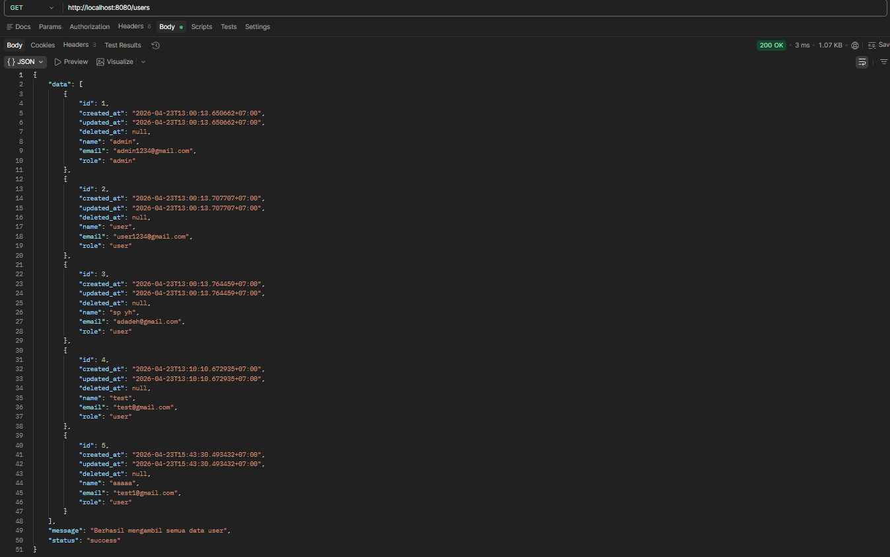
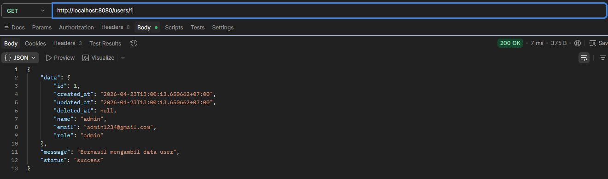
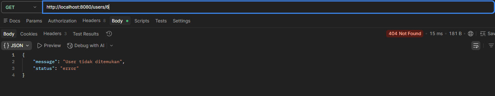

# Penugasan Day 2 Workshop ALPRO

|   Nama   | NRP |
|----------|---- |
|Isabella Sienna Sulisthio | 5025241199|

## Pengantar
Repository ini berisi pengerjaan tugas Day 2 Workshop ALPRO mengenai backend menggunakan `Golang` dan `PostgreSQL` untuk mengimplementasikan endpoint API POST dan GET berdasarkan template [repository yang telah diberikan](https://github.com/Mobilizes/materi-be-alpro.git).

## How To Run
1. Clone repository
```bash
git clone https://github.com/IsabellaSienna01/Alpro-day2.git
cd Alpro-day2
```
2. Jalankan `cmd/main.go`:
```bash
go run cmd/main.go seed #menjalankan seeder
go run cmd/main.go #menjalankan server
```
3. Server akan berjalan di: 
```bash
http://localhost:8080
```

## List Endpoint API
* `POST /users` : digunakan untuk mendaftarkan user baru.
* `GET /users`: digunakan untuk melihat seluruh list user.
* `GET /users/:id`: digunakan untuk melihat user berdasarkan ID.

---

Untuk menyelesaikan _challenge_ A dan B, diperlukan beberapa penyesuaian kode pada folder `modules/user` yang berisi konfigurasi seperti repository, service, controller, dan routing.
* Repository: mengambil data dari database
* Service: mengatur logic pengambilan data user
* Controller: menangani _request_ & _response_ API.
* Routing: menghubungkan _endpoint_ dengan controller.

Alur kerja ketika client melakukan request ke server:
```
 Client -> Controller -> Service -> Repository -> Database
```

## Challenge A -- `GET /users/:id`

> Ambil satu user berdasarkan ID. Kembalikan `404` jika tidak ditemukan.

Untuk menyelesaikan _challenge_ tersebut terdapat beberapa baris kode yang perlu ditambahkan pada masing-masing file sebagai berikut.

### 1) user_repository.go
```go
func (r *UserRepository) FindByID(id uint) (*entities.User, error){
    var user entities.User
    err := r.db.First(&user, id).Error
    return &user, err
}
```
Fungsi ini digunakan untuk mengambil satu data user berdasarkan ID dari database. `r.db.First(&user,id)` akan mencari data dengan PK = ID yang akan dikembalikan dalam bentuk pointer dalam struct `user`.

### 2) user_service.go
```go
func (s *UserService) GetUserByID(id uint) (*entities.User, error){
    return s.repo.FindByID(id)
}
```
Sebagai penghubung antara controller dan repository, fungsi ini akan meneruskan pemanggilan pada repository untuk mengambil data user berdasarkan ID.

### 3) user_controller.go
```go
func (ctrl *UserController) GetUserByID(c *gin.Context){
    idParam := c.Param("id")
    
    id, err := strconv.Atoi(idParam)
    if err != nil{
        utils.ErrorResponse(c, http.StatusBadRequest, "Format ID tidak valid")
        return
    }
    user, err := ctrl.service.GetUserByID(uint(id))
    if err != nil{
        if errors.Is(err, gorm.ErrRecordNotFound){
            utils.ErrorResponse(c, http.StatusNotFound, "User tidak ditemukan")
            return
        }
        utils.ErrorResponse(c, http.StatusInternalServerError, "Gagal mengambil data user")
        return
    }
    utils.SuccessResponse(c, http.StatusOK, "Berhasil mengambil data user", user)
}
```
Untuk menangani _request client_ yang akan meminta data user berdasarkan ID user, fungsi ini akan mengambil parameter ID dari URL, lalu dilakukan konversi dari string menjadi int menggunakan `str.conv.Atoi()`. Langkah berikutnya yaitu dilakukan validasi input, di mana jika format ID valid, maka _request_ akan diteruskan ke service untuk mengambil data user. 
- Jika data tidak ditemukan, server mengirimkan HTTP response `404 Not Found`. 
- Jika terjadi kesalahan lain, server akan mengirimkan HTTP response `500 Internal Server Error`.
- Jika pemanggilan data berhasil dilakukan, server akan mengirimkan HTTP response `200 OK`. 

### 4) routes.go
```go
users.GET("/:id", ctrl.GetUserByID)
```
Pada kode di atas kita perlu mendefinisikan endpoint `GET /users/:id` dengan menghubungkan endpoint tersebut dengan fungsi pada controller `GetUserByID` agar user dapat mengimplementasikan endpoint tersebut ketika server sedang berjalan.

---

## Challenge B -- `GET /users`

> Ambil semua user. Kembalikan array JSON

### 1) user_repository.go
```go
func (r *UserRepository) FindAll() ([]entities.User, error){
    var users []entities.User
    err := r.db.Find(&users).Error
    return users, err
}
```
Fungsi `FindAll()` akan digunakan untuk mengambil semua data user dari database, di mana `Find(&users)` akan mengisi semua record data ke dalam array yang akan di kembalikan ke user.

### 2) user_service.go
```go
func (s *UserService) GetAllUsers() ([]entities.User, error){
    return s.repo.FindAll()
}
```
Fungsi `GetAllUsers()` dalam modul service diimplementasikan untuk meneruskan _request_ dari controller ke repository.

### 3) user_controller.go
```go
func (ctrl *UserController) GetAllUsers(c *gin.Context){
   users, err := ctrl.service.GetAllUsers()
   if err != nil{
    utils.ErrorResponse(c, http.StatusInternalServerError, "Gagal mengambil data semua user")
    return
   }
   utils.SuccessResponse(c, http.StatusOK, "Berhasil mengambil semua data user", users)
}
```
Fungsi `GetAllUsers()` digunakan untuk menangani _request client_ untuk mengambil semua user yang ada pada database. Di mana pada implementasinya, fungsi ini akan memanggil service. Apabila pemanggilan ini gagal maka server akan memberikan HTTP response `500 Internal Server Error`. Sedangkan jika pemanggilan service berhasil dilakukan, server akan memberikan HTTP response `200 OK` dengan status `Berhasil Mengambil Semua Data User`.

### 4) routes.go
```go
users.GET("", ctrl.GetAllUsers)
```
Untuk mendefinisikan endpoint yang dapat diakses oleh user yaitu `GET /users` maka ditambahkan baris kode di atas untuk menghubungkannya dengan fungsi controller `GetAllUsers`.

---

Untuk memastikan bahwa endpoint API yang telah dibuat dapat berjalan dengan baik, kita perlu mengkoneksikan kode yang sudah dibuat dengan database PostGreSQL dengan membuat file `.env` yang berisikan konfigurasi mengenai database kita.
```bash
DB_USER=USER_DB
DB_PASSWORD=PASS_DB
DB_NAME=NAME_DB
DB_PORT=5432
```

Langkah berikutnya yaitu dengan membuat seeder dalam format `.json`yang akan dimasukkan ke dalam database secara otomatis. Adapun pembuatan seeder dapat dilakukan pada direktori `database` dengan membuat folder `seeders` dengan struktur folder sebagai berikut.
```
database
├───entities
│       
└───seeders
    │   user_seeder.go
    │   
    └───json
            users.json
```

File `json/users.json` merupakan data dummy user yang akan dimasukkan ke dalam database. Data tersebut akan diproses oleh fungsi seeder `user_seeder.go` yang bertugas untuk membaca file JSON, melakukan parsing data, dan mengisikan data tersebut ke database secara otomatis.

Fungsi seeder tersebut kemudian akan dipanggil dalam `cmd/main.go` agar data yang saat ini ada pada folder `json` dapat disimpan dalam database yang sudah dikonfigurasi pada file `.env`.
```go
    if len(os.Args) > 1 && os.Args[1] == "seed"{
        seeders.RunUserSeeder(db)
        return
    }
```

Apabila user ingin menjalankan server dalam mode seeding (menambahkan data dalam database), maka user dapat menjalankan kode `main.go` dengan argumen `seed`:
```bash
go run cmd/main.go seed
```

## Screenshot Hasil
1. Menambahkan data dengan endpoint `POST http://localhost:8080/users`
<br>


2. Mengambil semua data user dengan endpoint `GET http://localhost:8080/users`
<br>


3. Mengambil data user dengan ID 1 dengan endpoint `GET http://localhost:8080/users/1`
<br>


4. Mengambil data user yang tidak terdaftar dengan endpoint `GET http://localhost:8080/users/6`
<br>
